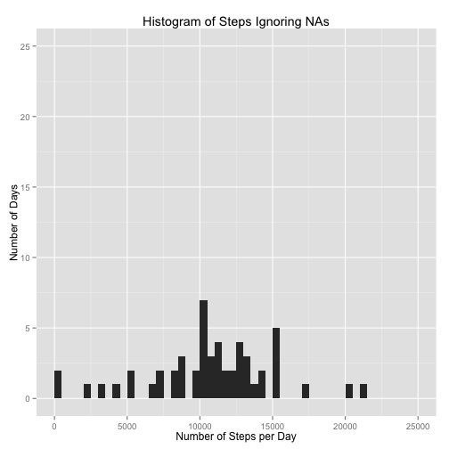
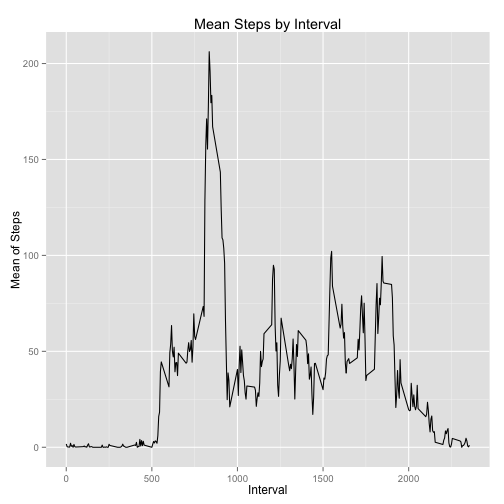
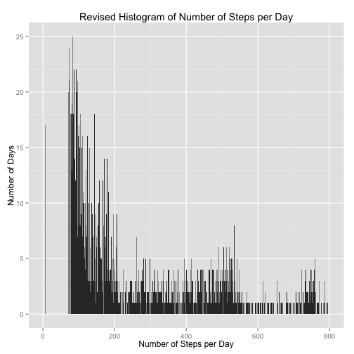
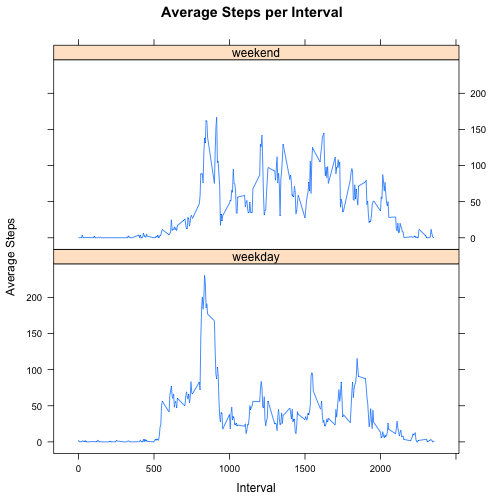

# Reproducible Research: Peer Assessment 1


## Loading and preprocessing the data

- Loads libraries ggplot2 and lattice
- Unzip 'activity.zip'
- Reads csv file 'activity.csv'
- Converts dates into POSIXlt class
- Lists day of the week of the date
- Creates new data frame from 'activity.csv', dates, and weekday columns


```r
library(ggplot2)
library(lattice)
unzip("activity.zip")
activity <- read.csv("activity.csv")
days <- strptime(as.character(activity[,2]), "%Y-%m-%d")
weekday <- weekdays(days)
steps <- activity[,1]
interval <- activity[,3]
clean <- data.frame(days,weekday,steps,interval)
names(clean) <- c("days","weekday","steps","interval")
```


## What is mean total number of steps taken per day?

- Sums steps by date
- Creates histogram of number of steps per day (ignoring NAs)
- Calculates the mean and median of the sum of steps per day


```r
stepday <- aggregate(clean$steps~days, data=clean, FUN=sum)

gsteps <- ggplot(stepday, aes(x=stepday[,2]))
gsteps+geom_histogram(binwidth=500)+xlim(c(0,25000))+ylim(c(0,25))+ xlab("Number of Steps per Day")+ylab("Number of Days")+ggtitle("Histogram of Steps Ignoring NAs")
```

 

```r
meanOne <- mean(stepday[,2])
medOne <- median(stepday[,2])
```

The average number of steps is 1.0766 &times; 10<sup>4</sup> and the median is 10765.

## What is the average daily activity pattern?

- Finds the mean of steps by the interval
- Graphs the mean of steps by the interval
- Finds the maximum number of steps
- Finds the interval that contains the maximum number of steps


```r
stepint <- aggregate(clean$steps~interval, data=clean, FUN=mean)
names(stepint) <- c("interval", "steps")
gstep <- ggplot(stepint, aes(x=stepint$interval, y=stepint$steps), group=1)
gstep+geom_line()+xlab("Interval")+ylab("Mean of Steps")+ggtitle("Mean Steps by Interval")
```

 

```r
maxstep <- max(stepint$steps)
maxstepint <- stepint$interval[which.max(stepint$steps)]
```

The maximum number of steps is 206.1698 and the interval that contains the maximum number of steps is 835.

## Imputing missing values

- Creates a logical vector for the presence of NAs
- Sums the amount of NAs in the dataset 
- Creates a new dataset called 'newClean' that replaces all the NAs with the mean of the corresponding interval, using for loop
- Creates a new histogram using the data with NAs removed


```r
notA <- is.na(steps)
sumNotA <- sum(notA)

newClean <- clean
for (i in 1:17568){
    if(is.na(clean[i,3])==TRUE){
        newClean[i,3] <- mean(clean[clean$interval==clean[i,'interval'],]$steps, na.rm=TRUE )
    }
}

gNewStep <- ggplot(newClean, aes(x=newClean[,3]))
gNewStep+geom_histogram(binwidth=1)+xlim(c(0,800))+ylim(c(0,25))+ xlab("Number of Steps per Day")+ylab("Number of Days")+ggtitle("Revised Histogram of Number of Steps per Day")
```

 

```r
meanNew <- mean(newClean[,3])
medianNew <- median(newClean[,3])
```

The number of NAs in the original dataset is 2304.
The mean of the revised data is 37.3826 and the median is 0.
These new mean and median calculations have changed greatly compared to the ones calculated with the NAs included in the dataset. Using the mean of the corresponding interval to fill out the NAs greatly reduced both the mean and the median.

## Are there differences in activity patterns between weekdays and weekends?

- Assigns weekday or weekend to the observation dates
- Averages steps over the intervals and for weekday/weekend
- Plots average steps over the intervals for both weekdays and weekend


```r
newClean$wkday <- ifelse(weekdays(newClean$days)=="Saturday"|weekdays(newClean$days)=="Sunday", newClean$wkday <- "weekend", newClean$wkday <- "weekday")
stepDay <- aggregate(steps~interval+wkday, data=newClean, FUN=mean)
xyplot(steps~interval|wkday, data=stepDay, type="l", layout=c(1,2), xlab="Interval", ylab="Average Steps", main="Average Steps per Interval")
```

 

While the highest number of average steps taken was between the 500 and the 1000 intervals during a weekday, a greater average of steps were taken over the 1000 to 2000 intervals on the weekend.
